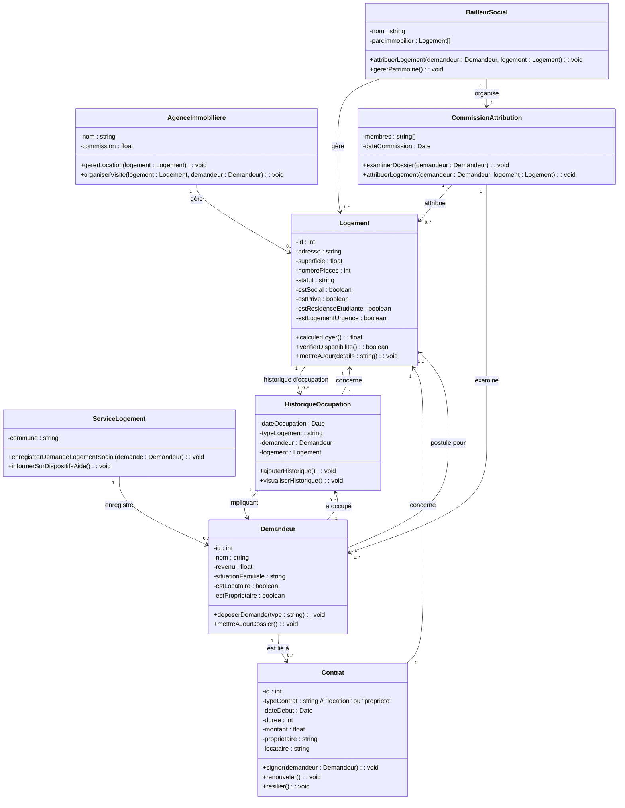

```mermaid

    classDiagram
    class Logement {
        -id : int
        -adresse : string
        -superficie : float
        -nombrePieces : int
        -statut : string
        -estSocial : boolean
        -estPrive : boolean
        -estResidenceEtudiante : boolean
        -estLogementUrgence : boolean
        +calculerLoyer() : float
        +verifierDisponibilite() : boolean
        +mettreAJour(details : string) : void
    }

    class Demandeur {
        -id : int
        -nom : string
        -revenu : float
        -situationFamiliale : string
        -estLocataire : boolean
        -estProprietaire : boolean
        +deposerDemande(type : string) : void
        +mettreAJourDossier() : void
    }

    class BailleurSocial {
        -nom : string
        -parcImmobilier : Logement[]
        +attribuerLogement(demandeur : Demandeur, logement : Logement) : void
        +gererPatrimoine() : void
    }

    class AgenceImmobiliere {
        -nom : string
        -commission : float
        +gererLocation(logement : Logement) : void
        +organiserVisite(logement : Logement, demandeur : Demandeur) : void
    }

    class ServiceLogement {
        -commune : string
        +enregistrerDemandeLogementSocial(demande : Demandeur) : void
        +informerSurDispositifsAide() : void
    }

    class CommissionAttribution {
        -membres : string[]
        -dateCommission : Date
        +examinerDossier(demandeur : Demandeur) : void
        +attribuerLogement(demandeur : Demandeur, logement : Logement) : void
    }

    class Contrat {
        -id : int
        -typeContrat : string  // "location" ou "propriete"
        -dateDebut : Date
        -duree : int
        -montant : float
        -proprietaire : string
        -locataire : string
        +signer(demandeur : Demandeur) : void
        +renouveler() : void
        +resilier() : void
    }

    class HistoriqueOccupation {
        -dateOccupation : Date
        -typeLogement : string
        -demandeur : Demandeur
        -logement : Logement
        +ajouterHistorique() : void
        +visualiserHistorique() : void
    }

    Logement "1" --> "0..*" HistoriqueOccupation : historique d'occupation
    HistoriqueOccupation "1" --> "1" Logement : concerne
    Demandeur "1" --> "0..*" HistoriqueOccupation : a occupé
    HistoriqueOccupation "1" --> "1" Demandeur : impliquant
    Demandeur "1" --> "0..*" Contrat : est lié à
    Contrat "1" --> "1" Logement : concerne
    BailleurSocial "1" --> "1..*" Logement : gère
    BailleurSocial "1" --> "1" CommissionAttribution : organise
    AgenceImmobiliere "1" --> "0..*" Logement : gère
    ServiceLogement "1" --> "0..*" Demandeur : enregistre
    CommissionAttribution "1" --> "0..*" Logement : attribue
    Demandeur "1" --> "0..1" Logement : postule pour
    CommissionAttribution "1" --> "0..*" Demandeur : examine

```
