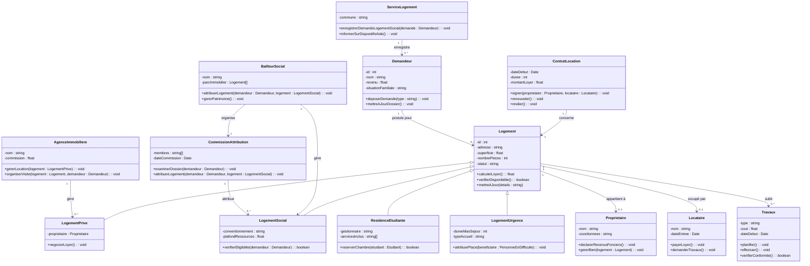

```mermaid

     classDiagram
    class Logement {
        -id : int
        -adresse : string
        -superficie : float
        -nombrePieces : int
        -statut : string
        +calculerLoyer() : float
        +verifierDisponibilite() : boolean
        +mettreAJour(details : string)
    }

    class LogementSocial {
        -conventionnement : string
        -plafondRessources : float
        +verifierEligibilite(demandeur : Demandeur) : boolean
    }

    class LogementPrive {
        -proprietaire : Proprietaire
        +negocierLoyer() : void
    }

    class ResidenceEtudiante {
        -gestionnaire : string
        -servicesInclus : string[]
        +reserverChambre(etudiant : Etudiant) : boolean
    }

    class LogementUrgence {
        -dureeMaxSejour : int
        -typeAccueil : string
        +attribuerPlace(beneficiaire : PersonneEnDifficulte) : void
    }

    class Proprietaire {
        -nom : string
        -coordonnees : string
        +declarerRevenusFonciers() : void
        +gererBien(logement : Logement) : void
    }

    class Locataire {
        -nom : string
        -dateEntree : Date
        +payerLoyer() : void
        +demanderTravaux() : void
    }

    class Demandeur {
        -id : int
        -nom : string
        -revenu : float
        -situationFamiliale : string
        +deposerDemande(type : string) : void
        +mettreAJourDossier() : void
    }

    class BailleurSocial {
        -nom : string
        -parcImmobilier : Logement[]
        +attribuerLogement(demandeur : Demandeur, logement : LogementSocial) : void
        +gererPatrimoine() : void
    }

    class AgenceImmobiliere {
        -nom : string
        -commission : float
        +gererLocation(logement : LogementPrive) : void
        +organiserVisite(logement : Logement, demandeur : Demandeur) : void
    }

    class ServiceLogement {
        -commune : string
        +enregistrerDemandeLogementSocial(demande : Demandeur) : void
        +informerSurDispositifsAide() : void
    }

    class CommissionAttribution {
        -membres : string[]
        -dateCommission : Date
        +examinerDossier(demandeur : Demandeur) : void
        +attribuerLogement(demandeur : Demandeur, logement : LogementSocial) : void
    }

    class ContratLocation {
        -dateDebut : Date
        -duree : int
        -montantLoyer : float
        +signer(proprietaire : Proprietaire, locataire : Locataire) : void
        +renouveler() : void
        +resilier() : void
    }

    class Travaux {
        -type : string
        -cout : float
        -dateDebut : Date
        +planifier() : void
        +effectuer() : void
        +verifierConformite() : boolean
    }

    Logement <|-- LogementSocial
    Logement <|-- LogementPrive
    Logement <|-- ResidenceEtudiante
    Logement <|-- LogementUrgence
    Logement "1" --> "0..1" Proprietaire : appartient à
    Logement "1" --> "0..1" Locataire : occupé par
    Logement "1" --> "0..*" Travaux : subit
    BailleurSocial "1" --> "1..*" LogementSocial : gère
    AgenceImmobiliere "1" --> "0..*" LogementPrive : gère
    ServiceLogement "1" --> "0..*" Demandeur : enregistre
    CommissionAttribution "1" --> "0..*" LogementSocial : attribue
    ContratLocation "1" --> "1" Logement : concerne
    Demandeur "1" --> "0..1" Logement : postule pour
    BailleurSocial "1" --> "1" CommissionAttribution : organise
```
