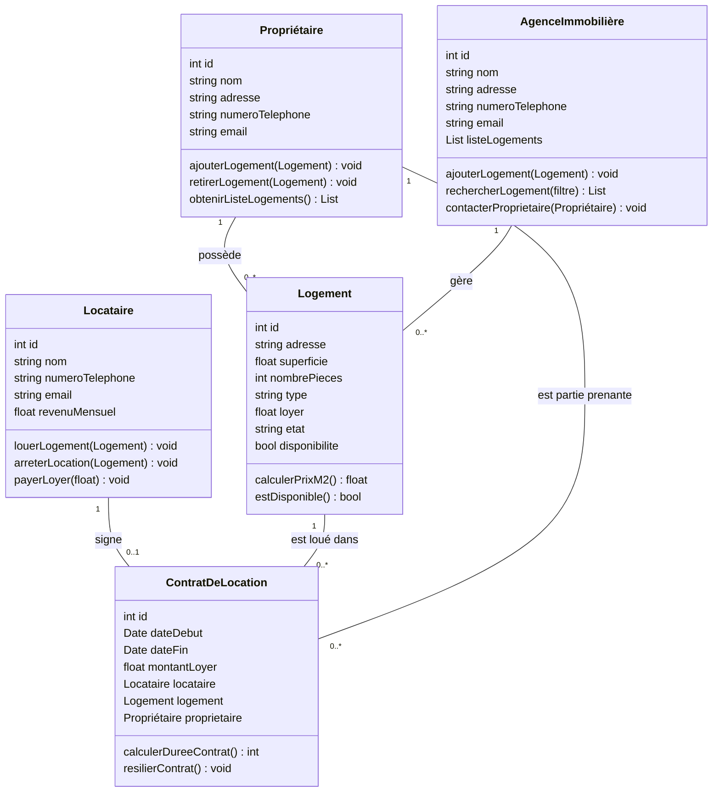

```mermaid
classDiagram
    class Logement {
        int id
        string adresse
        float superficie
        int nombrePieces
        string type
        float loyer
        string etat
        bool disponibilite
        calculerPrixM2() float
        estDisponible() bool
    }

    class Propriétaire {
        int id
        string nom
        string adresse
        string numeroTelephone
        string email
        ajouterLogement(Logement) void
        retirerLogement(Logement) void
        obtenirListeLogements() List<Logement>
    }

    class Locataire {
        int id
        string nom
        string numeroTelephone
        string email
        float revenuMensuel
        louerLogement(Logement) void
        arreterLocation(Logement) void
        payerLoyer(float) void
    }

    class AgenceImmobilière {
        int id
        string nom
        string adresse
        string numeroTelephone
        string email
        List<Logement> listeLogements
        ajouterLogement(Logement) void
        rechercherLogement(filtre) List<Logement>
        contacterProprietaire(Propriétaire) void
    }

    class ContratDeLocation {
        int id
        Date dateDebut
        Date dateFin
        float montantLoyer
        Locataire locataire
        Logement logement
        Propriétaire proprietaire
        calculerDureeContrat() int
        resilierContrat() void
    }

    Propriétaire "1" -- "0..*" Logement : possède
    Locataire "1" -- "0..1" ContratDeLocation : signe
    Logement "1" -- "0..*" ContratDeLocation : est loué dans
    Propriétaire "1" -- "0..*" ContratDeLocation : est partie prenante
    AgenceImmobilière "1" -- "0..*" Logement : gère

   
```
